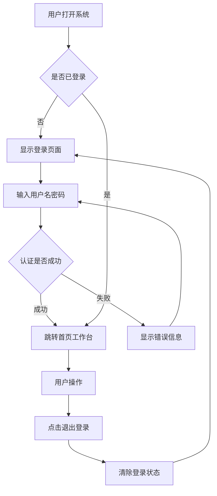

# DICT项目管理系统 - 产品需求文档

## 1. 产品概述

DICT项目管理系统是一款面向企业级用户的B端项目管理系统，旨在为企业提供全方位的项目管理和业务跟踪能力。系统主要服务于项目经理、销售团队和高层管理人员，帮助企业实现项目全生命周期管理、商机跟踪、销售业绩监控等核心业务流程的数字化管理。

系统核心价值在于：通过统一的项目管理平台，整合商机信息、项目进度、财务数据等多维度业务数据，为企业决策提供数据支撑，提升项目执行效率和客户满意度。

## 2. 核心功能

### 2.1 用户角色

| 角色 | 说明 | 核心权限 |
|------|------|----------|
| 系统管理员 | 系统的全面管理者 | 用户管理、角色权限配置、系统设置 |
| 项目经理 | 项目执行负责人 | 项目创建、任务分配、进度跟踪 |
| 客户经理 | 销售业务负责人 | 商机管理、销售数据统计、客户跟进 |
| 财务人员 | 财务数据管理者 | 回款管理、欠费统计、财务报表 |
| 高层管理 | 决策层用户 | 数据看板、全局统计、报表分析 |

### 2.2 功能模块

1. **首页工作台**：整合待办事项、系统公告、关键业务指标的数据看板
2. **项目管理**：项目创建、任务分配、进度跟踪、文档管理
3. **商机管理**：商机信息维护、销售漏斗分析、商机转化跟踪
4. **合同管理**：合同创建、审批流程、合同执行跟踪
5. **财务管理**：回款管理、欠费统计、财务报表
6. **系统管理**：用户管理、角色权限、菜单管理、系统配置

### 2.3 页面详情

| 页面名称 | 模块名称 | 功能描述 |
|---------|----------|----------|
| 首页工作台 | 顶部导航栏 | 左侧显示"DICT项目管理系统"系统名称，右侧显示当前用户姓名"张凯"、角色"客户经理"、退出登录按钮 |
| 首页工作台 | 左侧菜单栏 | 可伸缩的侧边导航菜单，支持2-3级菜单展示，一级菜单带图标，包含项目管理、商机管理、合同管理、财务管理、系统管理等模块 |
| 首页工作台 | 我的待办 | 展示当前用户需要处理的任务列表，包括任务名称、关联项目、截止日期、优先级等字段，支持快捷操作标记完成 |
| 首页工作台 | 我的待阅 | 展示当前用户需要查阅的通知/审批/变更/进度信息，支持二级 Tab 分类筛选：全部、审批待阅、变更待阅、进度待阅、其他 |
| 首页工作台 | 我的提醒 | 展示即将到期的任务、待审批事项、合同到期提醒等预警信息 |
| 首页工作台 | 系统公告 | 展示系统管理员发布的各类通知公告，支持标题、时间、紧急程度展示 |
| 首页工作台 | 关键指标卡片 | 4-6个核心业务指标卡片，包括：商机数量、中标金额、回款金额、欠费金额、项目数量、在建项目数等 |

## 3. 核心流程

### 3.1 用户登录登出流程

### 3.2 首页工作台数据加载流程

## 4. 用户界面设计

### 4.1 设计风格

- **设计定位**：专业、高效、清晰的企业级B端系统风格
- **色彩方案**：
  - 主色调：#1890ff（科技蓝）
  - 辅助色：#52c41a（成功绿）、#faad14（警告黄）、#f5222d（错误红）
  - 背景色：#f0f2f5（浅灰背景）
  - 文字色：#333333（主文字）、#666666（次要文字）、#999999（辅助文字）
- **按钮样式**：圆角按钮，悬浮态有明显阴影效果
- **字体选择**：思源黑体（Source Han Sans SC）作为中文字体，Roboto作为英文数字字体
- **布局风格**：采用经典的左右布局，顶部固定导航栏，左侧可折叠菜单，内容区域自适应
- **图标风格**：使用线性图标，简洁大方

### 4.2 页面设计概览

| 页面名称 | 模块名称 | UI元素 |
|---------|----------|--------|
| 首页工作台 | 顶部导航栏 | 高度60px，白色背景，左侧蓝色logo区，右侧用户信息区带下拉菜单 |
| 首页工作台 | 左侧菜单 | 宽度240px（折叠时64px），可显示2-3级菜单，一级菜单带图标，支持鼠标悬浮展开 |
| 首页工作台 | 待办列表 | 卡片式布局，每条待办显示勾选框、任务名称、项目标签、截止日期、优先级标识 |
| 首页工作台 | 待阅列表 | 列表式布局，每条待阅显示类型图标、标题、内容摘要、时间、查阅按钮；顶部展示二级 Tab 用于分类筛选（全部/审批待阅/变更待阅/进度待阅/其他） |
| 首页工作台 | 提醒模块 | 时间轴样式展示，红色强调紧急事项，支持快捷处理按钮 |
| 首页工作台 | 系统公告 | 列表展示，包含紧急程度标识、标题、发布时间，支持点击查看详情 |
| 首页工作台 | 指标卡片 | 2行3列的网格布局，每个卡片包含指标图标、指标数值、指标名称、环比变化 |

### 4.3 响应式策略

采用桌面端优先的设计理念，确保在1920×1080、1440×900、1366×768等常见分辨率下完美展示。侧边菜单在小分辨率下自动折叠为图标模式。最小支持宽度1024px。

### 4.4 动画效果

- 页面加载：指标卡片依次淡入上浮，间隔80ms
- 菜单展开：平滑高度过渡，300ms ease-out
- 按钮交互：hover时scale(1.02)，点击时scale(0.98)
- 数据更新：数字滚动动画效果
