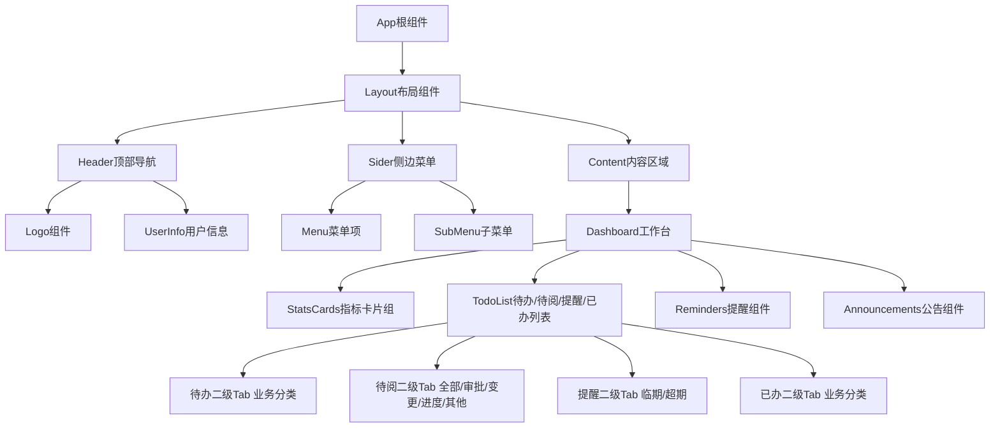

# DICT项目管理系统 - 技术架构文档

## 1. 架构设计

```mermaid
graph TB
    subgraph 前端层
        A[React@18 单页应用]
    end

    subgraph 样式层
        B[TailwindCSS@3 原子化CSS]
    end

    subgraph 构建层
        C[Vite@5 快速构建工具]
    end

    subgraph 数据层
        D[Mock数据 本地模拟]
    end

    A --> B
    C --> A
    D --> A
```

本项目采用前后端分离架构，前端使用React18 + Vite + TailwindCSS技术栈实现，采用Mock数据模拟后端接口，确保在无后端环境下完整运行。

## 2. 技术选型

- **前端框架**：React@18
- **构建工具**：Vite@5
- **样式方案**：TailwindCSS@3 + CSS变量
- **图标库**：Lucide React（线性图标）
- **数据模拟**：JavaScript本地Mock数据
- **字体**：Google Fonts - 思源黑体 / Roboto

## 3. 路由定义

| 路由 | 用途 | 说明 |
|------|------|------|
| /home | 首页工作台 | 系统主页面，包含所有核心模块展示 |
| /projects | 项目管理 | 项目列表和详情页（路由预留） |
| /business | 商机管理 | 商机跟踪页面（路由预留） |
| /contracts | 合同管理 | 合同管理页面（路由预留） |
| /finance | 财务管理 | 财务数据页面（路由预留） |
| /system | 系统管理 | 系统设置页面（路由预留） |

## 4. 数据模型

### 4.1 用户信息模型

```javascript
{
  id: string,           // 用户ID
  name: string,         // 姓名：张凯
  role: string,         // 角色：客户经理
  avatar: string        // 头像URL
}
```

### 4.2 待办事项模型

```javascript
{
  id: string,           // 待办ID
  title: string,        // 任务标题
  project: string,       // 关联项目
  deadline: string,      // 截止日期
  priority: 'high' | 'medium' | 'low',  // 优先级
  completed: boolean    // 是否完成
}
```

### 4.3 提醒数据模型

```javascript
{
  id: string,           // 提醒ID
  type: 'task' | 'approval' | 'contract',  // 提醒类型
  title: string,        // 提醒标题
  content: string,      // 提醒内容
  time: string,         // 提醒时间
  urgent: boolean       // 是否紧急
}
```

### 4.4 待阅数据模型

```javascript
{
  id: string,           // 待阅ID
  type: 'task' | 'approval' | 'contract',  // 业务类型
  title: string,        // 待阅标题
  content: string,      // 待阅内容
  time: string,         // 待阅时间
  urgent: boolean,      // 是否紧急
  readCategory: 'approval' | 'change' | 'progress' | 'other'  // 待阅分类
}
```

- **approval**：审批待阅，包含合同、报价、立项决策书等待审批触发的消息
- **change**：变更待阅，包含项目范围变更、里程碑调整等通知
- **progress**：进度待阅，包含项目进度更新、验收阶段提醒等
- **other**：其他不属于以上分类的待阅

### 4.5 系统公告模型

```javascript
{
  id: string,           // 公告ID
  title: string,        // 公告标题
  content: string,      // 公告内容
  publishTime: string,   // 发布时间
  level: 'normal' | 'important' | 'urgent'  // 紧急程度
}
```

### 4.6 关键指标模型

```javascript
{
  id: string,           // 指标ID
  name: string,         // 指标名称
  value: number | string,  // 指标数值
  unit: string,         // 单位
  change: number,       // 环比变化百分比
  icon: string          // 图标名称
}
```

## 5. 组件架构



## 6. 项目结构

```
CMI_AH/
├── index.html                 # 入口HTML文件
├── package.json               # 项目依赖配置
├── vite.config.js             # Vite构建配置
├── tailwind.config.js         # TailwindCSS配置
├── postcss.config.js          # PostCSS配置
├── src/
│   ├── main.jsx               # React入口文件
│   ├── App.jsx                 # 根组件
│   ├── index.css              # 全局样式文件
│   ├── components/
│   │   ├── Layout/
│   │   │   ├── Header.jsx     # 顶部导航组件
│   │   │   ├── Sider.jsx       # 侧边菜单组件
│   │   │   └── index.js
│   │   └── Dashboard/
│   │       ├── StatsCards.jsx  # 指标卡片组件
│   │       ├── TodoList.jsx    # 待办列表组件
│   │       ├── Reminders.jsx   # 提醒组件
│   │       ├── Announcements.jsx # 公告组件
│   │       └── index.js
│   ├── data/
│   │   └── mock.js            # Mock数据
│   └── utils/
│       └── constants.js       # 常量定义
└── .trae/
    └── documents/
        ├── PRD.md             # 产品需求文档
        └── TECH.md            # 本技术文档
```
